<h1 align="center">FER2013 Emotion Recognition Benchmark</h1>
<p align="center"><b>Six models compared on FER2013, from pixel-based ML baselines to a custom CNN and ImageNet transfer learning, plus a Streamlit app to test them on your own images.</b></p>

<p align="center">
  
  
  
  
  
  
</p>

<p align="center">
  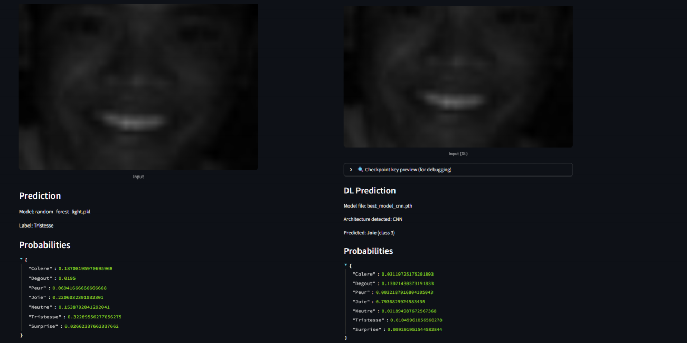
</p>
<p align="center"><i>The same image in the Streamlit app: Random Forest (left) predicts the wrong emotion, the Custom CNN (right) gets it right.</i></p>


---

## TL;DR

| | |
|---|---|
| **Task** | Classify 48×48 grayscale faces into 7 emotions: angry, disgust, fear, happy, sad, surprise, neutral |
| **Models compared** | Logistic Regression, Random Forest, SVM (RBF), **Custom CNN**, ResNet50 (transfer), VGG16 (transfer) |
| **Best model** | **Custom CNN trained from scratch: 66.86 % accuracy, 0.651 macro-F1** (validation, best epoch) |
| **Key finding** | A 5.87M-parameter CNN beats ImageNet backbones, including VGG16 with 24× more parameters |
| **Hardest part** | Class imbalance (Disgust: 436 images vs Happy: 7,215, a 1:16.5 ratio) and ~15 % label noise |
| **Imbalance fix** | Class-weighted loss + weighted batch sampling: Disgust recall rises from near zero (ML baselines) to **0.77** |
| **Demo** | Streamlit app: pick any `.pkl` or `.pth` model, upload an image, see per-class probabilities |

---

## Dataset

[FER2013](https://www.kaggle.com/datasets/msambare/fer2013) (ICML 2013 challenge): about 35,887 grayscale faces at 48×48 px, 7 emotion classes.

| Set | Images | Share |
|---|---:|---:|
| Train | 22,968 | 64.1 % |
| Validation | 5,741 | 16.0 % |
| Test | 7,178 | 20.0 % |

Reproducible split (seed 42, 80/20 on the training data).

| Class | Images (train + val) | Note |
|---|---:|---|
| Happy | 7,215 | Majority class |
| Neutral | 4,965 | Reference state |
| Sad | 4,830 | Subtle expression |
| Fear | 4,097 | Often confused with surprise |
| Angry | 3,995 | Well represented |
| Surprise | 3,171 | Often confused with fear |
| **Disgust** | **436** | **1:16.5 against Happy** |

<p align="center">
  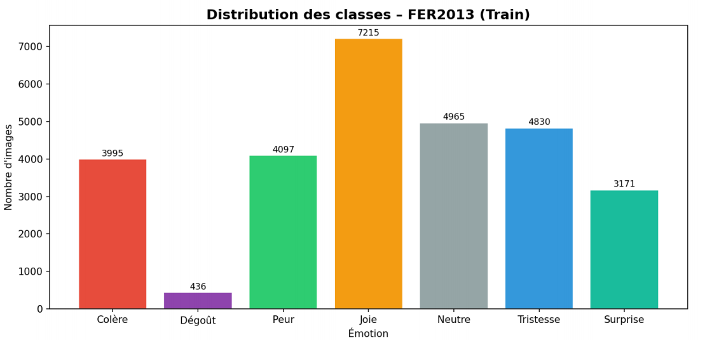
</p>

**Known limits of the dataset:** very low resolution, limited ethnic diversity, an estimated ~15 % labelling noise, and a domain gap with real-world photos. Some raw images are also corrupted (fully black frames) or carry watermarks.

<p align="center">
  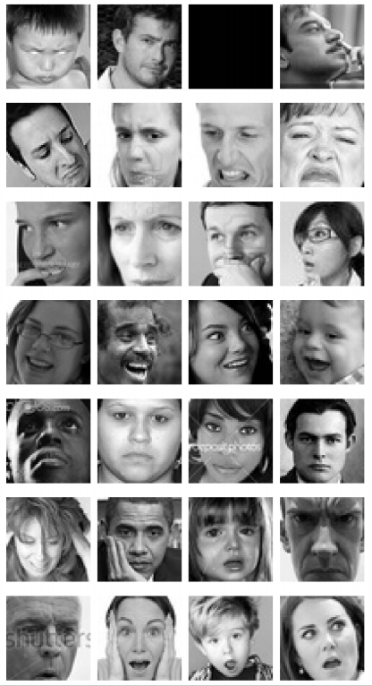
</p>

---

## Preprocessing

A modular pipeline (`preprocessing.py`) with three intensity levels, selected per use case.

| Pipeline | Steps | When |
|---|---|---|
| `minimal` | CLAHE only | Clean images |
| **`light`** *(default)* | Adaptive denoising + CLAHE | Recommended |
| `aggressive` | Forced Non-Local Means + CLAHE | Heavily degraded images |

1. **Grayscale + resize to 48×48.** Harmonises RGB-encoded images; resize acts as a safeguard.
2. **Noise estimation.** σ̂ = std(I − G<sub>σ=1</sub>(I)): subtract a lightly smoothed copy and measure what remains. Below 50 the image is considered clean, 50 to 150 gets a bilateral filter, above 150 gets Non-Local Means (thresholds calibrated on FER2013).
3. **Adaptive denoising.** Bilateral filter (d=5, σ<sub>color</sub>=50, σ<sub>space</sub>=50) preserves edges such as eyebrows and lips. Non-Local Means (h=10, 7×7 template, 21×21 search) for strong noise.
4. **CLAHE** (clip limit 1.5, 4×4 tiles), applied *after* denoising so noise is not amplified.
5. **Z-score normalisation** (µ = 0.5071, σ = 0.2520).

<p align="center">
  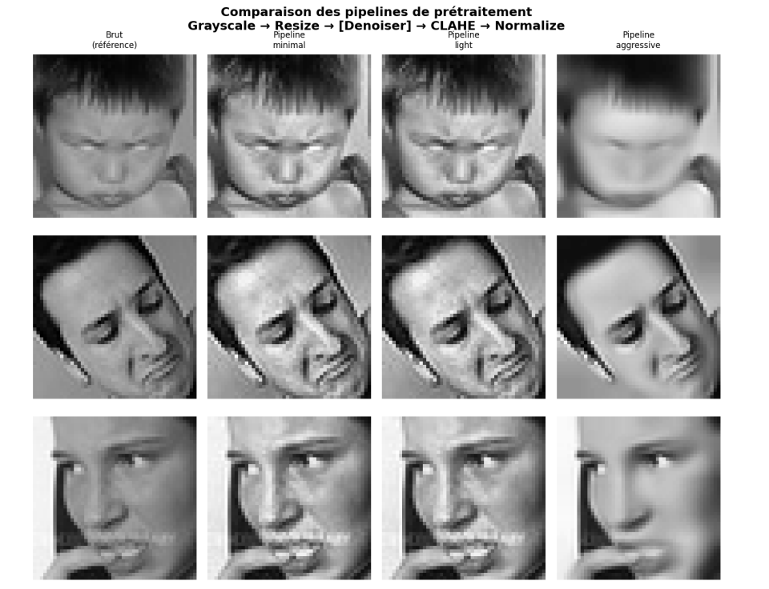
</p>
<p align="center"><i>`minimal` leaves noise, `light` is the best trade-off, `aggressive` over-smooths and erases wrinkles and teeth.</i></p>

<p align="center">
  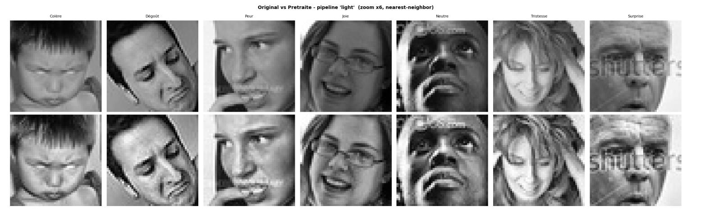
</p>

### Augmentation (training only, on the fly)

Horizontal flip (p=0.5) · rotation ±10° · affine (translation ±5 %, scale 0.95 to 1.05) · ColorJitter (brightness/contrast 0.7 to 1.3) · RandomAdjustSharpness (p=0.3) · RandomErasing (p=0.2, 2 to 8 % of the area) to simulate occlusions such as glasses or hands.

<p align="center">
  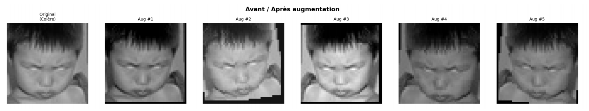
</p>

### Handling class imbalance

Class weights are inversely proportional to class frequency, normalised so they sum to the number of classes, and passed to `nn.CrossEntropyLoss`.

| Angry | Disgust | Fear | Happy | Neutral | Sad | Surprise |
|---:|---:|---:|---:|---:|---:|---:|
| 0.4800 | **4.3982** | 0.4681 | 0.2658 | 0.3862 | 0.3970 | 0.6047 |

The Custom CNN additionally uses a `WeightedRandomSampler` so every batch is balanced across classes.

---

## Models

### Classical ML baselines (flattened 2,304-pixel vectors)

| Model | Key hyperparameters |
|---|---|
| Logistic Regression | `saga`, `max_iter=1000`, `C=1.0` (L2) |
| Random Forest | 200 trees, `max_depth=30`, `min_samples_split=5` |
| SVM (RBF) | `C=10`, `gamma=scale`, trained on a **subset** (computational cost) |

They treat every pixel independently, so the spatial structure of the face (an eyebrow edge, a mouth corner) is lost.

### Custom CNN (from scratch, ~5.87M parameters)

Pyramidal design: as resolution drops, the number of filters grows.

| Stage | Output | Content |
|---|---|---|
| Block 1 | 24×24×64 | 2× (Conv 3×3 + BatchNorm + ReLU) → MaxPool 2×2 → Dropout2d(0.25) |
| Block 2 | 12×12×128 | same structure |
| Block 3 | 6×6×256 | same structure |
| Head | 7 | Linear(9216→512) + BatchNorm + ReLU → Dropout(0.5) → Linear(512→7) |

**Training:** weighted cross-entropy + weighted random sampler, Adam, batch 64, `ReduceLROnPlateau` on validation macro-F1, early stopping (patience 10). Training was split into three resumed sessions, each restarting from the best saved weights.

### Transfer learning (ImageNet, VGG16 and ResNet50)

Adaptations: resize 48→224 (bilinear), replicate the gray channel to 3, ImageNet normalisation, new 7-class head.

| | ResNet50 | VGG16 |
|---|---|---|
| Optimiser | Adam, cosine annealing | Adam, LR 1e-4 |
| Batch size | 96 | 32 |
| Epochs | 46 in 3 phases | 30 |
| Regularisation | Dropout 0.5 | Dropout (FC layers) |
| Strategy | Progressive unfreezing | Fine-tuning |

---

## Results

| Family | Model | Accuracy | Macro-F1 | Evaluated on |
|---|---|---:|---:|---|
| Classical ML | Logistic Regression | ≈ 35 % | ≈ 0.33 | Test |
| Classical ML | SVM (RBF) | ≈ 41 % | ≈ 0.41 | Test |
| Classical ML | Random Forest | ≈ 46 % | ≈ 0.49 | Test |
| Transfer learning | ResNet50 | 44.36 % | 0.399 | Test |
| Transfer learning | VGG16 | ≈ 58 to 59 % | n/a | Validation |
| **From scratch** | **Custom CNN** | **66.86 %** | **0.651** | **Validation (best epoch 175)** |

<p align="center">
  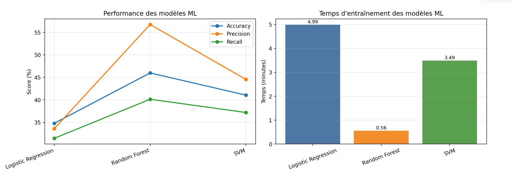
</p>

### What the experiments show

- **Pixels are not enough.** The three ML baselines top out at ≈ 46 %. Logistic Regression reaches ≈ 85 % train accuracy but only ≈ 27 to 29 % validation accuracy. Random Forest has near-zero train error. All of them over-predict Happy and Neutral and almost never get Disgust.
- **The custom CNN wins clearly.** Mean recall across the 7 classes goes from ≈ 32 to 40 % (ML) to ≈ 66 %. Disgust recall goes from near zero to **0.77**, the biggest single gain. Per-class F1: Happy ≈ 0.85, Surprise ≈ 0.80, Fear and Sad ≈ 0.50 to 0.53.
- **Bigger is not better.** VGG16 (138M parameters) reaches ≈ 99 % train accuracy but stalls at ≈ 58 to 59 % validation, a textbook overfit for ≈ 28,000 images. ResNet50 improved with each unfreezing phase (val macro-F1 0.3505 → 0.3700 → 0.3985) but stays at 44.4 %, partly because RGB 224×224 pretraining fits grayscale 48×48 faces poorly.
- **ResNet50 per class:** Happy F1 0.629 and Surprise 0.597 are best; Neutral acts as a "refuge" class (precision 0.375); Disgust only reaches F1 0.181 despite weighting (111 test samples).

### Confusion matrices

<table align="center">
  <tr>
    <td align="center">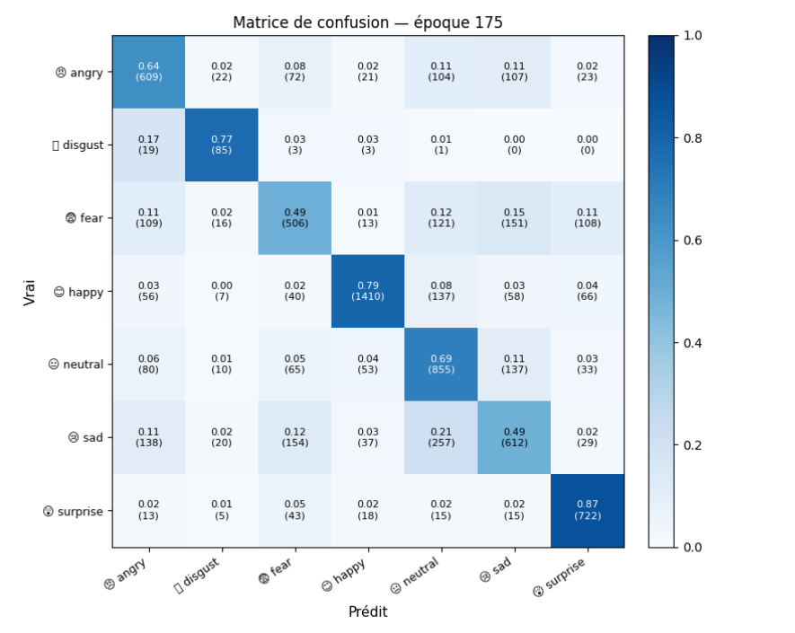<br/><b>Custom CNN</b> (normalised)</td>
    <td align="center">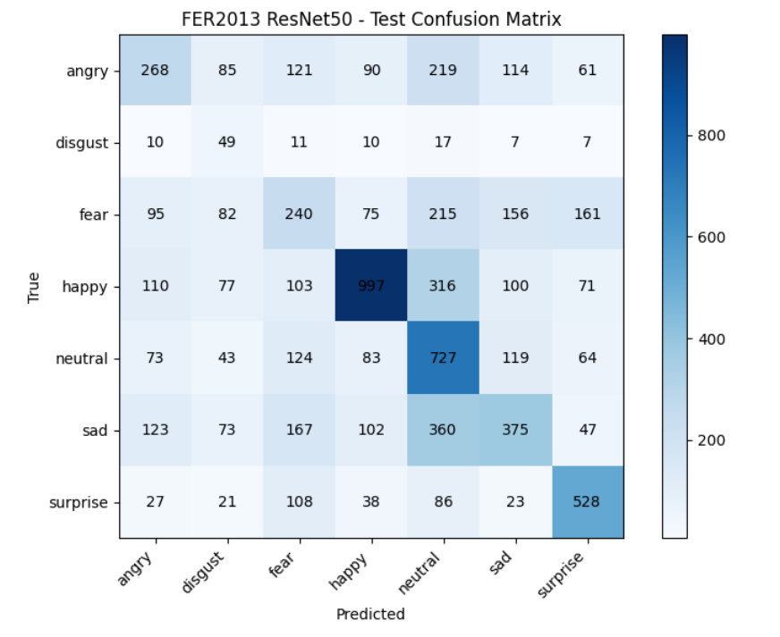<br/><b>ResNet50</b></td>
    <td align="center">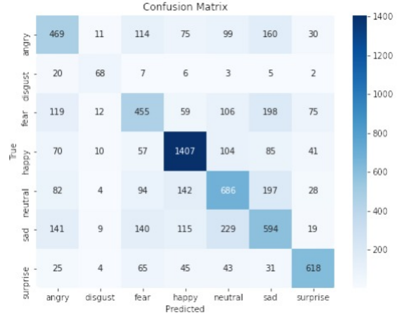<br/><b>VGG16</b></td>
  </tr>
</table>

<p align="center">
  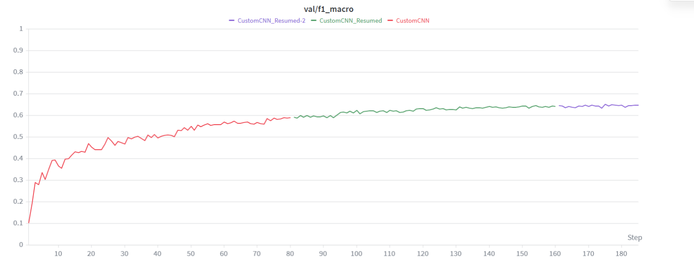
</p>

<table align="center">
  <tr>
    <td align="center">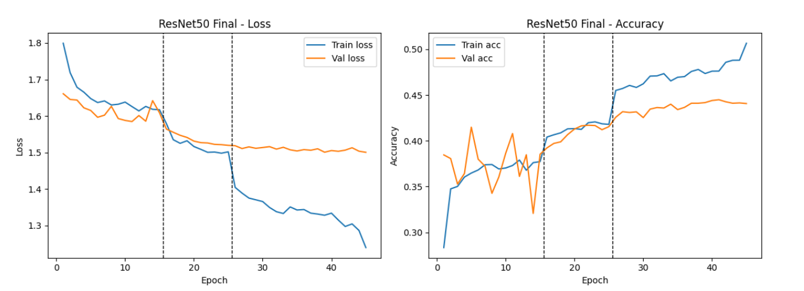<br/><b>ResNet50</b> (dashed lines = phases)</td>
    <td align="center">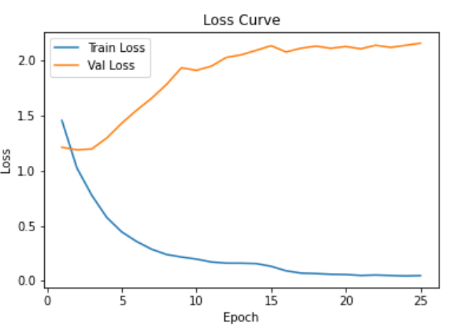<br/><b>VGG16</b> loss: validation loss rises</td>
  </tr>
</table>

---

## Interactive demo (Streamlit)

<p align="center">
  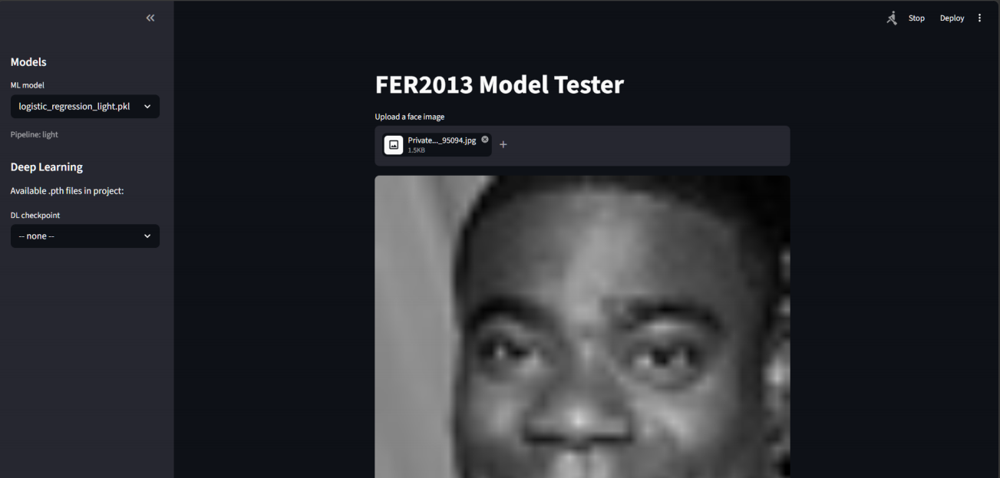
</p>

- **Sidebar:** lists every `.pkl` in `saved_models/` and every `.pth` / `.pt` in the project root. File names encode the model and its preprocessing pipeline (e.g. `random_forest_light.pkl`), and the app applies the matching pipeline automatically.
- **Main area:** upload an image, see the prediction and the full probability vector over the 7 classes.
- **Robust checkpoint loading:** extracts the weights from several checkpoint formats (`model_state_dict`, `state_dict`, `model_state`, or raw tensors) and **detects the architecture from parameter-name prefixes** (`features.*` → VGG16, `layer1.*` → ResNet50, `block1.*` → CustomCNN). It falls back to non-strict loading with a warning, and offers a debug panel with parameter shapes.

| Path | Pipeline |
|---|---|
| Classical ML | `joblib.load` → grayscale 48×48 → selected pipeline → Z-score → flatten (2,304) → `predict` / `predict_proba` |
| Deep learning | `torch.load` → architecture detection → matching preprocessing → `eval()` + `no_grad()` → softmax |

<table align="center">
  <tr>
    <td align="center">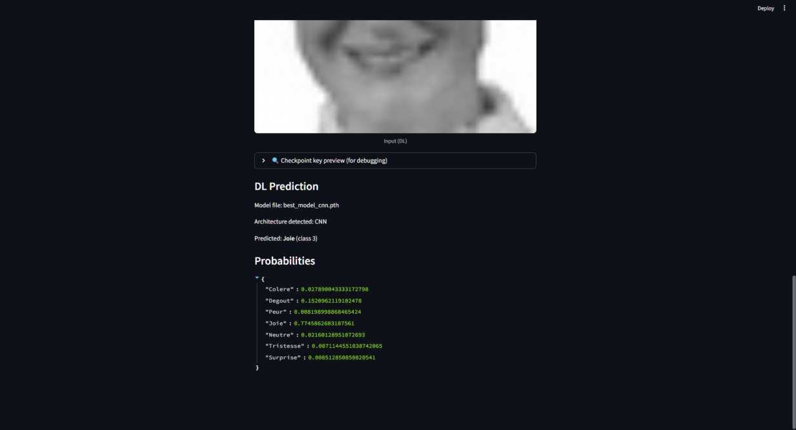<br/><b>Clear emotion:</b> Happy, p ≈ 0.77</td>
    <td align="center">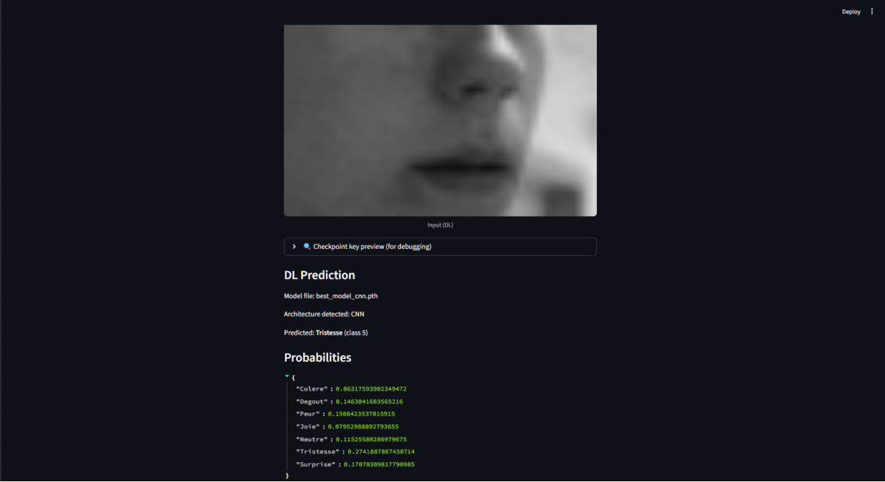<br/><b>Ambiguous:</b> Fear, probability spread over Fear / Sad / Disgust / Surprise</td>
  </tr>
</table>

Not implemented: live webcam stream with face detection, and Grad-CAM visualisation.

---

## Key lessons

1. **Representation quality matters most.** Going from raw pixels to convolutional features was the largest gain, ahead of any hyperparameter tuning.
2. **Model size must match data size.** VGG16 was designed for 1.2M images; FER2013 is far too small for its capacity.
3. **Imbalance is structural.** Fear and Sad are the weak spots of every model because of visual proximity and label noise.

## Limitations

- Custom CNN and VGG16 figures come from the **validation set**; the ML models and ResNet50 figures come from the **test set**. The comparison among deep models is on validation.
- The SVM was trained on a **subset** because of its quadratic cost.
- About 15 % label noise in FER2013 caps achievable accuracy, and results are on one dataset only.
- No live video and no interpretability (Grad-CAM) in the app.

## Future work

- Modern backbones better suited to small images (EfficientNet-B4, Vision Transformer), or lighter ones (MobileNetV2, EfficientNet-B0)
- Early stopping on validation loss and freezing lower blocks for VGG16
- Targeted augmentation for hard classes and **label smoothing** against annotation noise
- Ensembles combining several architectures
- Complementary descriptors: facial landmarks and FACS Action Units
- Webcam stream with face detection and Grad-CAM in the app

---

## Repository structure

```
fer2013-emotion-recognition-benchmark/
├── dataset/                          # train/ and test/, one folder per emotion
├── preprocessed_samples/             # preprocessed images (git-ignored)
├── saved_models/                     # classical ML models (.pkl)
├── *.pth, *.pt                       # deep-learning checkpoints (project root)
├── streamlit_app.py                  # Streamlit UI for .pkl and .pth models
├── ml_train.py                       # train and save ML models (LogReg, RF, SVM)
├── preprocessing.py                  # preprocessing transforms and dataset helpers
├── resultat_preprocessing_clean.py   # runs preprocessing + ML training with defaults
├── *.ipynb                           # experiment and training notebooks
└── requirements.txt
```

## Getting started

```bash
git clone https://github.com/MedSahbiBenKalia/fer2013-emotion-recognition-benchmark.git
cd fer2013-emotion-recognition-benchmark

python -m venv venv
venv\Scripts\activate          # Windows
source venv/bin/activate       # Linux / macOS

pip install -r requirements.txt
```

Run the Streamlit tester (web UI):

```bash
streamlit run streamlit_app.py
```

Run the lightweight preprocessing + ML runner (default settings):

```bash
python resultat_preprocessing_clean.py
```

### Training

The ML training helpers live in `ml_train.py` and expect either a `fer2013.csv` file (pre-extracted features) or image folders under `dataset/`:

```bash
python - <<PY
from ml_train import run_ml_models
import preprocessing
run_ml_models(preprocessing, csv_path='fer2013.csv', pipeline='light')
PY
```

The deep-learning experiments (Custom CNN, ResNet50, VGG16) are in the notebooks.

### Data and checkpoints

- Dataset layout: `dataset/train/<emotion>/*.png` and `dataset/test/<emotion>/*.png`. Emotion folder names must match the labels used in `preprocessing.py`. Download FER2013 from [Kaggle](https://www.kaggle.com/datasets/msambare/fer2013).
- Classical ML models are saved as `.pkl` in `saved_models/`. Deep-learning weights (`.pth` / `.pt`) live in the project root.
- Keep large binaries (models, datasets, preprocessed samples) out of version control; use cloud storage or Git LFS if you need versioning.

## References

Goodfellow et al., *Challenges in Representation Learning* (ICML 2013) · He et al., *Deep Residual Learning* (CVPR 2016) · Simonyan & Zisserman, *Very Deep Convolutional Networks* (ICLR 2015) · Mollahosseini et al., *AffectNet* (IEEE TAC 2019) · Ekman & Friesen (1971).

## Authors

**Mohamed Sahbi Ben Kalaia** · Yassine Dahmoul · Leith Engazzou · Hiba Chabbouh · Takoua Ayadi 
INSAT, Image Processing (GL4), 2025/2026

> 📄 **Full project report (in French):** [`Rapport.pdf`](Rapport.pdf)
> It covers the dataset analysis, preprocessing, model architectures, training curves, confusion matrices and the Streamlit demo in detail.